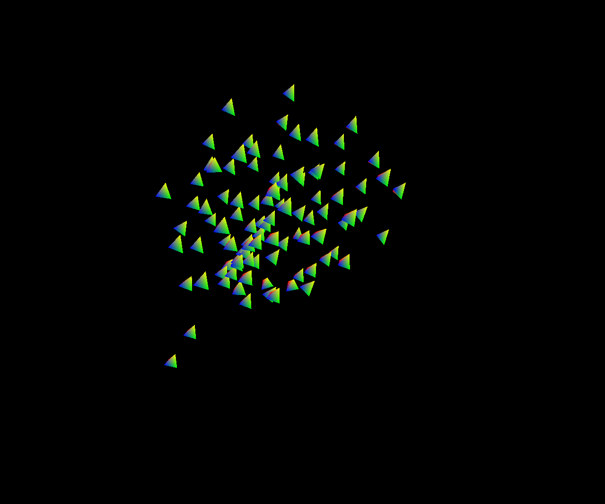
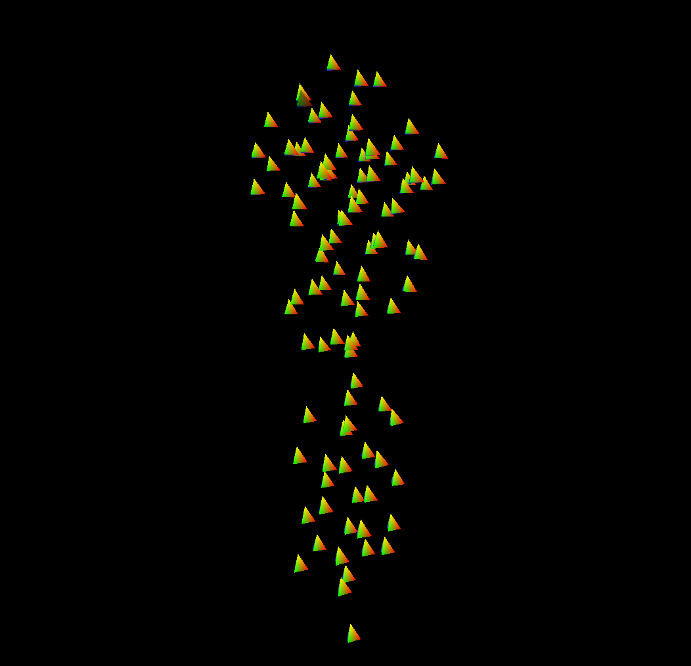
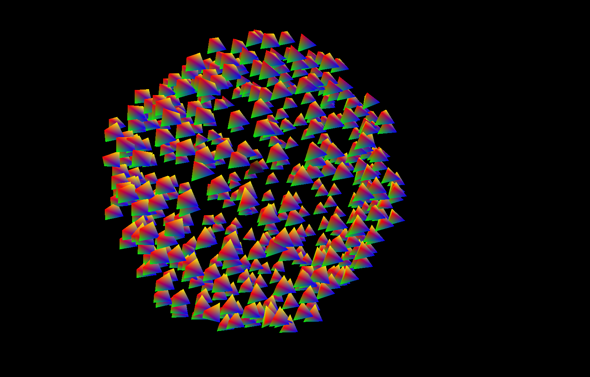

# Boids 模拟系统

一个使用 C++ 和 OpenGL 实现的鸟群行为模拟系统，基于 Craig Reynolds 的 Boids 算法。

## 效果演示

### 自由飞行:

### 跟随头鸟:

### 带形状飞行

## 说明

- 安装:克隆仓库后检查项目依赖配置,若缺失则手动配置依赖即可,所需依赖库已在Dep文件夹中
- 使用:直接运行即可,三种飞行方式通过Birdsystem的update函数参数个数的不同进行切换

## 安装

### 前提条件

- Visual Studio 2022 或更高版本
- 
